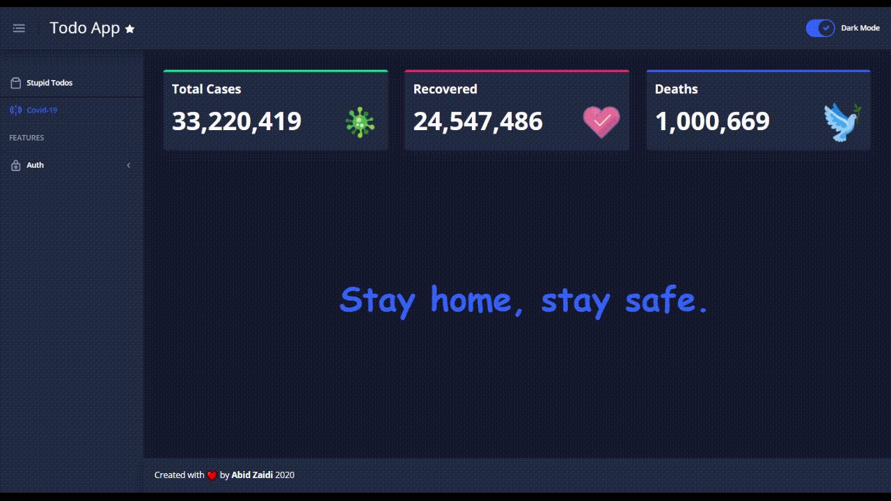
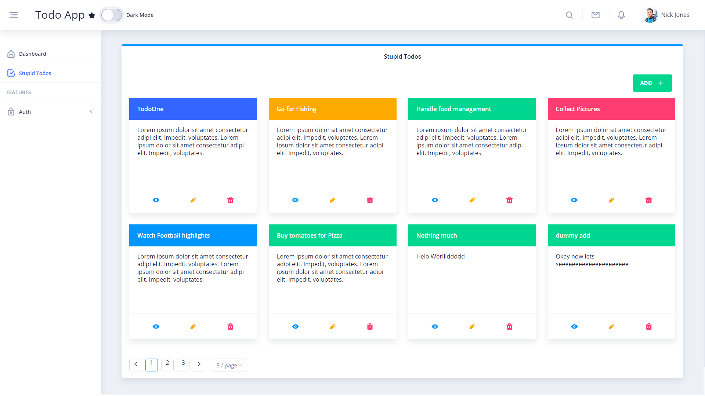
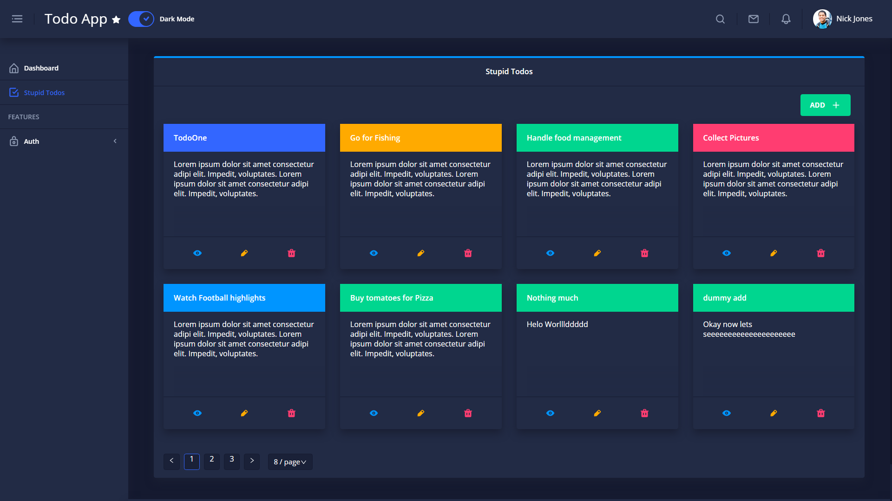
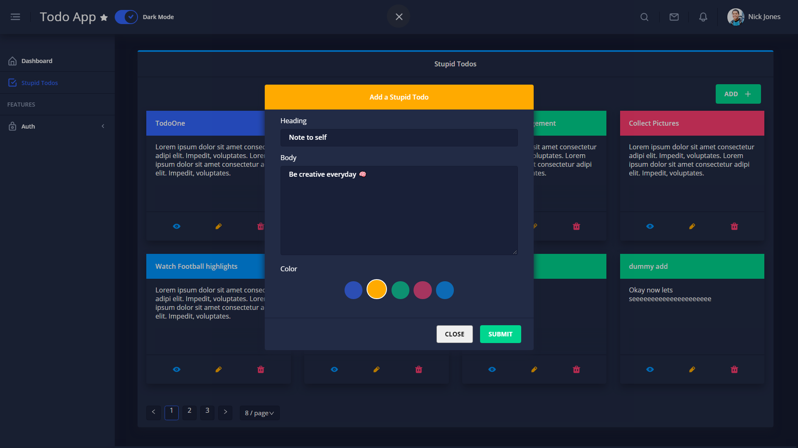

# Todo Application Using Angular & Nebular

  

This project consumes Python [API](https://github.com/aliabidzaidi/pythontodoapi) for data

### With 2 visual themes

#### Default

#### Dark

#### Add a Todo

## Documentation

This project is using [Nebular](https://github.com/akveo/nebular) modules set, [here you can find documentation and other useful articles](https://akveo.github.io/nebular/docs/guides/install-based-on-starter-kit).

#### Deploy on firebase

ng build --prod
firebase deploy --only hosting:utitlity-todo
